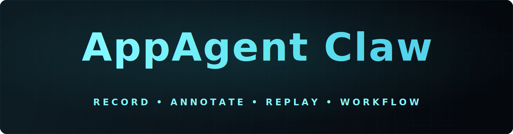

<div align="center">
  
  <h1>AppAgent-Claw</h1>
  <p><strong>把 GUI 演示转化为可复用、并逐步可迁移的 agent skill。</strong></p>
  <p>
    <a href="README.md">English</a> ·
    <a href="https://github.com/Westlake-AGI-Lab/AppAgent-Claw/releases">Releases</a> ·
    <a href="#demos">Demo</a> ·
    <a href="#quick-start">快速开始</a> ·
    <a href="#agent--skill-integration">Skill 集成</a>
  </p>
</div>

AppAgent-Claw 是一个 macOS GUI skill framework，用来把一次前台桌面操作演示转换成可复用、可检查、并可逐步迁移的自动化 artifact。

它的定位是刻意收窄的。AppAgent-Claw **不是**一个 open-domain 的 computer-use agent，而是一座连接 agent 平台与 GUI-only 软件的工程化桥梁：先把流程录下来，再补充轻量语义标注，然后用分层定位、重试、校验和结构化诊断把它稳定回放出来。

### TL;DR

- **Record**：从一次 GUI 演示中录下前台工作流。
- **Annotate**：给保存下来的流程补上轻量语义和可参数化文本槽位。
- **Replay**：用分层匹配、重试、校验和结构化诊断把流程稳定回放出来。

## 为什么要做这个项目

像 OpenClaw 这样的 agent 平台之所以有吸引力，一个重要原因是它们可以调用轻量、可复用的 skill。但现实里大量软件能力仍然主要暴露在 GUI 上，而不是稳定的 API 或 CLI 上。于是就出现了一个缺口：agent 具备推理能力，却缺少一个可靠的方式去操作真正承载任务的软件界面。

AppAgent-Claw 的目标，就是用更务实的方式补上这个缺口。它不追求无限开放场景下的电脑使用，而是聚焦在**固定前台流程**：用户示范一次，系统把这条 GUI 路径保存成可检查、可回放、可复用的工作流。它受 AppAgentX 启发，也继承了经典 RPA 的工程思路，但进一步加入了面向 agent 复用所需的语义描述与参数化能力。

## 它是什么 / 它不是什么

| AppAgent-Claw 是 | AppAgent-Claw 不是 |
| --- | --- |
| 面向熟悉工作环境的工作流复用层 | 跨机器迁移方案 |
| 带显式回放资产的前台桌面自动化能力 | 后台窗口自动化 |
| 带有标注与语义补充的回放系统 | 依赖 OCR 的通用桌面理解系统 |
| 可被 agent 调用的轻量 skill | 自动自修复脚本生成器 |

当前版本从熟悉工作环境中的稳定回放出发，并在这个基础上继续推进更强的步骤语义理解与更可迁移的 workflow 复用能力。

<a id="demos"></a>
## Demos / 演示

> 下面直接嵌入了可在 GitHub 页面内播放的 demo 视频。

<table>
  <tr>
    <td align="center" width="50%">
      <strong>网易云音乐 · 录制</strong><br />
      <video
        src="https://github.com/user-attachments/assets/550f700b-ed6b-44f1-a0cf-489eb8cc66d0"
        width="100%"
        controls
        muted
        playsinline
        preload="metadata"
      ></video>
    </td>
    <td align="center" width="50%">
      <strong>网易云音乐 · 回放</strong><br />
      <video
        src="https://github.com/user-attachments/assets/7c164b1e-06e0-449a-95bb-4b97047bbaf7"
        width="100%"
        controls
        muted
        playsinline
        preload="metadata"
      ></video>
    </td>
  </tr>
</table>

这个 demo 展示了项目最核心的两件事：先通过演示“教会”一个固定 GUI 流程，再在后续执行中用窗口准备、视觉匹配、兜底策略和运行日志把它回放出来。

- **网易云音乐** 例子重点展示了在相近界面状态下，对固定媒体交互流程的稳定录制与回放。

## How it works / 工作原理

1. **Record**：从 macOS 前台应用捕获一次用户演示，并保存回放所需的关键资产，例如 `anchor.png`、`context.png`、`search_region`、动作元数据和窗口上下文。
2. **Annotate**：补全 `flow.json`，写入 `flow.description`、每一步的说明，以及可安全参数化的 `type_text` 文本槽位。
3. **Replay**：在可行时先恢复窗口，再对点击类目标执行三阶段定位：
   - 在记录区域附近做局部 anchor matching
   - 在记录显示器范围内做更大范围的 context matching
   - 如果视觉匹配失败，再退回相对坐标兜底
4. **Validate and diagnose**：用重试、动作后校验和结构化 `run.json` 把失败原因保留下来，而不是只给一个黑盒结果。

## 为什么它重要

- **比纯 perception-only GUI agent 更实用**：对于同机重复流程，工程稳定性更高。
- **比原始宏录制器更语义化**：保存的不只是动作序列，还有流程描述和参数化文本元数据。
- **更容易接到 agent 系统里**：最终产物天然像一个轻量可复用 skill，而不是一次性的录制文件。

<a id="quick-start"></a>
## Quick Start / 快速开始

### 环境要求

- macOS
- Python `3.13+`
- `swift` 在 `PATH` 中可用
- 给运行脚本的终端或 Python 解释器授予 macOS“辅助功能”权限
- 给同一个进程授予 macOS“屏幕录制”权限

### 安装

```bash
uv sync
source .venv/bin/activate
```

如果系统里没有 `swift`，先安装 Xcode Command Line Tools 或完整 Xcode。

### 录制一个流程

```bash
python scripts/record.py start --name demo-flow
```

录制器会弹出一个小浮窗。你需要先在浮窗里开始录制，然后到目标应用里完成流程，最后按 `Esc` 停止。

### 回放这个流程

```bash
python scripts/replay.py run "demo-flow" --debug
```

回放目标可以是：

- 一个录制目录
- 一个直接的 `flow.json` 路径
- 一个已保存的流程名

如果按名称回放，会选择“规范化名称完全匹配”的最新录制结果。

新的录制结果会保存在 `data/recordings/` 下，而每次回放的日志和调试产物会写入 `data/runs/`。

### 运行本地检查

```bash
python -m py_compile scripts/*.py tests/*.py
pytest -q
```

## 更多常用命令

对已有录制重新生成标注：

```bash
python scripts/record.py annotate "demo-flow"
```

带运行时文本参数回放：

```bash
python scripts/replay.py run "demo-flow" --inputs-json '{"input_message_body_01":"今晚这首太好了"}' --debug
```

只有 `text_policy.mode = "parameterized"` 的 `type_text` 步骤，才允许在回放时被覆盖。

<a id="agent--skill-integration"></a>
## Agent / Skill Integration / Skill 集成

AppAgent-Claw 被设计成一个可以被现有 agent runtime 直接调用的轻量 GUI skill。

这三个平台的预打包 skill 将通过 **GitHub Releases** 分发，而不是作为主仓库里的运行时目录长期维护。

Release 页面：<https://github.com/Westlake-AGI-Lab/AppAgent-Claw/releases>

| 平台 | Release 产物 | 说明 |
| --- | --- | --- |
| OpenClaw | `appagent-claw-openclaw.zip` | 面向 OpenClaw 的打包 skill bundle，用于录制、标注、回放和打包可复用 GUI workflow。 |
| Codex | `appagent-claw-codex.zip` | 面向 Codex 的自包含 skill bundle，内置 AppAgent-Claw 所需运行时与 workflow 目录约定。 |
| Claude Code | `appagent-claw-claude-code.zip` | 面向 Claude Code 的自包含 skill bundle，采用相同的打包运行时与 workflow 模型。 |

如果你主要是想在某个 agent runtime 里直接使用 AppAgent-Claw，建议优先从对应平台的 release bundle 开始，而不是先克隆整个仓库。

如果你是在仓库里开发，请直接使用根项目并执行 `uv sync`。如果你是给 agent runtime 分发，请直接下载对应平台的 release 产物。

## 运行时数据与示例

| 路径 | 用途 |
| --- | --- |
| `data/recordings/` | 本地开发与手动测试时产生的录制结果 |
| `data/runs/` | 回放日志、调试素材与失败诊断 |
| [`examples/recordings/`](examples/recordings/) | 仓库内长期保留、可提交的精选示例流程 |

当前仓库内置的精选样例：

- [`examples/recordings/20260414_214025_netease-play-daily-recommendation`](examples/recordings/20260414_214025_netease-play-daily-recommendation)

## 仓库结构

核心运行时代码位于 `scripts/`：

- `record.py` — 录制入口
- `annotation.py` — 录后说明生成与文本槽位分析
- `replay.py` — 回放入口
- `recorder.py` — 事件聚合与步骤生成
- `capture.py` — 截图资产生成
- `resolver.py` — 回放时目标定位
- `executor.py` — 动作执行
- `storage.py` — 流程与运行结果存储
- `schema.py` — 流程协议定义
- `window_context.py` — 前台窗口元数据与恢复辅助

## 当前限制

- 中文、日文、韩文等依赖输入法提交的文本，在部分应用里录制仍不稳定。
- 高动态界面区域仍可能让回放退回相对坐标兜底。
- 回放默认假设窗口布局、显示器环境和应用状态与录制时接近。
- 录后标注器目前仍是启发式且偏保守；依赖动态文本复用前请先检查 `flow.json`。
- 目标应用必须处于当前前台桌面会话中并可访问。

## Roadmap / 路线图

### 每一步的语义理解

- 未来会让 GUI agent 介入录制与回放的每一个步骤，理解当前动作“在做什么”，而不只是记录点击位置或输入内容。
- 将底层交互轨迹提升为更高层的工作流语义，使录下来的流程更容易检查、修改和复用。
- 以步骤级语义对齐为基础，逐步推动 workflow 从单机可回放，走向更可迁移的执行形式。

### 更深度的 agent 参与

- 让 GUI agent 不只在录后补 metadata，而是在录制、标注、回放三个阶段都更深入地参与进来。
- 让 agent 帮助描述步骤意图、识别可参数化输入、校验中间界面状态，并判断当前回放步骤是否仍然符合原任务目标。
- 探索一种 hybrid 模式：确定性的 replay 仍然作为主骨架，而 GUI agent 负责解释、调整和在环境变化时辅助恢复。

### 从单机 skill 到可迁移 workflow

- 借助步骤语义理解，逐步降低 workflow 对某一台机器上精确布局、坐标和视觉状态的依赖。
- 让 workflow artifact 同时保存录制证据与 agent 可读意图，使一次示范得到的 skill 能以更少人工重录的成本迁移到其他环境。
- 为今天的可复用 skill workflow 与未来更自主的 demonstration-driven GUI agent 之间建立更自然的过渡路径。

## Citation / 引用

如果你觉得这个工作对你有帮助，欢迎引用 AppAgent-Claw。我们的 technical report 很快会公开；目前你也可以先引用 GitHub 仓库：

```bibtex
@software{westlake_agi_lab_appagent_claw_2026,
  author = {{Westlake-AGI-Lab}},
  title = {AppAgent-Claw},
  url = {https://github.com/Westlake-AGI-Lab/AppAgent-Claw},
  year = {2026}
}
```

## 许可证

[Apache License 2.0](LICENSE)

## 反馈与共建

由于时间比较仓促，这个项目目前很可能还存在不少问题，包括实现细节不完善、边界情况覆盖不足，或者一些使用体验上的粗糙之处。

如果你发现 bug、行为不清晰的地方，或者觉得某些 workflow 还有优化空间，欢迎随时提 issue 或直接提交 PR，一起把 AppAgent-Claw 做得更好。
